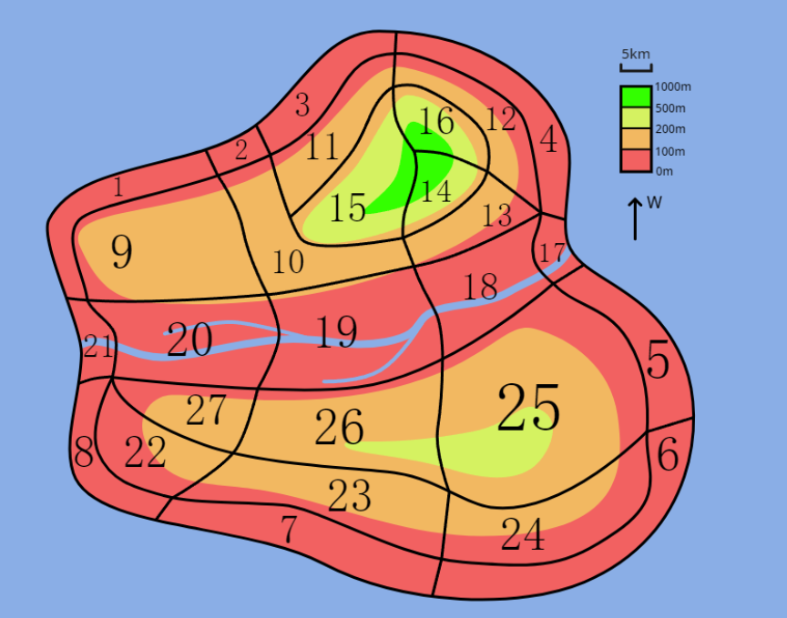

千年牢笼
==

# 1 - 前言

本模组是随《永恒之岛规则书》第一版附赠的模组，供大家试玩。如果您还没有熟悉游戏的规则，建议先通读一遍规则书。

本模组专为《永恒之岛》的新手设计的，对缺乏经验的求生者和永恒之王较为友好。如果您是第一次担任永恒之王的玩家，请记得在游戏开始前至少先通读一遍本模组以熟悉这座岛的环境，并在游戏过程中将本模组和规则书放在手边以供随时查阅。

请勿向玩家直接展示本模组的内容。

# 2 - 概述

这是一座面积约为1万平方千米的岛屿，长宽都接近100千米。若求生者想要通过步行横穿这座岛屿，他们将花费2~3天的时间。

岛屿被沙滩环绕，一条宽约10米的河流横穿了这座岛，从东部流向西部。河流将整座岛大致分为了南北两个区域。北部区域地势相对较高，有一座海拔近1000米的山峰；南部区域地势则相对较低且更平坦。

这座岛上的气候类似于亚热带季风气候——这意味着岛上的气温较为温和，夏季气温约为20摄氏度，冬季气温也不低于10摄氏度；岛上的气候较为湿润，尤其夏季经常下雨，其他季节的雨量明显少于夏季，但空气一直较为湿润。永恒之王可以将游戏的开局设定在春季或秋季，因为这些季节岛上的气候最为温和。

永恒之王可以在每天早上或任何适当的时机通过一个暗骰来判断现在岛上是否会开始下雨。夏季每天早上有1/3的概率会下雨（骰1D6，若结果小于或等于2则认为当天会下雨），其他季节每天早上有1/6的概率会下雨。永恒之王可以适当修改这些规则，例如调整降雨的概率、默认第一天是晴天并跳过暗骰等。

在这样温和的气候下，求生者们对水和食物的需求量也会相对较少，而且求生者也不易因炎热或寒冷而受到损害，永恒之王可以放宽这四种损害的判定。不过需要注意的是，求生者们晚上休息时必须生起一堆火，或至少有一个适当的庇护所才能保持温暖。冬天他们将更难保持温暖。

岛上的四季变化速度比地球上快得多，一个季度只有大约10天——这是为了让游戏节奏更快，避免游戏过程过于无趣。记住，永恒之岛是一座位于异世界的神奇岛屿，它可以不遵循地球上的一些逻辑。永恒之王也可以根据自己的希望来适当更改岛上的四季变化速度。

```
为了吸引玩家的兴趣，您可以在游戏开始前先透露岛上的一小部分信息，例如“气候温和”这点。玩家即便提前知道了也不会对游玩体验有任何影响——无论如何，他们在进入游戏后马上就会发现这一点的！
```

建议求生者们使用随机属性或18点购点制。

推荐永恒之王将求生者们的初始位置设定在沙滩上、区域9附近、河流沿岸区域或区域22附近——这些区域较易生存。不建议永恒之王将求生者们的初始位置设定在区域14~16或区域23~26，这些区域较危险而且过于接近故事的本源——下文将对此进行详细叙述。

# 3 - 岛屿地图

这是一张粗糙的分层设色地形图：



```
如果您的设备无法在此文档中查看上方的图片，不用担心！本模组附带了一张单独的岛屿地图供查看。
```

分层设色地形图是一种用不同颜色来表示不同海拔高度的地图，您没必要像一名地理学家一样看懂它，您只需要知道：右上角标注了不同颜色与不同海拔高度之间的对应关系，颜色越接近绿色的部分就越高。

地图上已经将岛屿用黑色的线条分为了27个区域并标注上了相应的序号。不要对这些密密麻麻的数字感到头皮发麻——事实上，很多区域都仅仅是为了便于永恒之王记录求生者的位置才分开的，它们共用同一套描述！您也不需要记住所有区域的特点，只需要大致熟悉它们就可以了——这就是我们建议您随时把完整的模组放在手边的原因！

## 区域1~4

这些区域是岛屿北部的海滩地区，有着美丽的阳光、沙滩和海风（在这里休息或许有助于恢复求生者的精神打击），偶尔还会有一些红椰树，夏天还会有刺壳龟在这里筑巢和产卵。求生者在这里闲逛时，每小时有1/3的概率遇到一丛2~3棵红椰树。夏天和秋天还每小时还会有1/6的概率遇到一处刺壳龟的巢穴。

```
“矮椰树”和“刺壳龟”等生物的信息都会在本模组的第四部分详细地列出！
```

## 区域5~8

这些区域是岛屿南部的海滩地区，环境与北部海滩相似，但不会有刺壳龟在这里产卵。求生者在区域5和区域6闲逛一小时有1/2的概率发现一只赤蟹。

## 区域9~13

这是一片阔叶树林，主要由桦树、糯树和其他一些常绿阔叶树构成（永恒之王可以发挥想象力添加任何你认为合理的树木），树冠虽然茂密但仍有很多阳光透过树冠照射进来。若求生者希望通过观察天空来获取有关时间或方向的信息，永恒之王可以发起一个观察或知识检定。森林中主要有鳞猪、草狼、黑纹蛇、野兔和老鼠等动物，还会有一些小型鸟类。需要注意的是这里的草狼通常是在狩猎，所以它们很可能会对面前的求生者穷追不舍——求生者在战斗时将更难逃脱！森林中还很容易找到一些野菜和浆果，但这些野菜和浆果中约1/3是有毒的。永恒之王可以暗骰一个知识检定来判断求生者能否分辨出它们的毒性。若求生者吃下了有毒的野菜或浆果，他们暂时不会有什么不适感，但当晚休息时他们就会开始发病，症状可以由永恒之王自由发挥——恶心、呕吐、腹泻、头晕、头痛、四肢酸痛等，合理即可。届时他们将被视为患病状态，必须针对疾病进行健康损害检定。这些症状一直持续到第二天早上，意味着中毒的求生者一晚上都会睡得不安稳，因此恢复创伤时他们将承受一个惩罚骰。森林中还有茂盛的野草和藤条，其中许多都易于打结，是制作各种工具的良好材料。地面上随手就能拿到一些枯枝败叶，可以用来生火（如果求生者打算钻木取火，建议永恒之王发起一次知识-敏捷联合检定）。求生者在这里闲逛时，每小时有1/6的概率遇到一只野生动物。（也可以在适当的时机让求生者发现一些脚印等猎物的踪迹来帮助求生者捕猎！）

## 区域14~16

这里是一座山脉。山上的植被与山下没有太大差别，但海拔越高植被就越少，尤其是高大的树木。山顶位于区域14的北部，这附近只能偶尔见到一些野草，且一片死寂。半山腰可能会非常偶尔地出现一群草狼或一只野兔之类的小动物，但这里的草狼不会主动攻击求生者，相反，它们见到求生者后总是会倾向于向着远离山顶的方向逃离求生者。

山顶上有一块立着的石头，上面有一些凹刻的文字，看起来像是一块年代十分久远的石碑。一个成功的知识检定可以使求生者辨认出这些文字是某种类似英语的表音文字，并能猜出这些文字大致的发音，但无法准确、连贯地读出来，还可以推测出其中有一个表示人名或地名的词汇——读音类似于“chenegia”。求生者无论如何也无法完全理解这些文字的意义——事实上，这些文字的一个古代文明留下来的咒语（求生者们并不知道这一点）。任何试图仔细检查石碑的求生者都会感到一阵眩晕，还会在脑内响起一个诡异的声音，此时求生者需要进行一次理智检定，因为这些咒语的魔力会让人发狂。这种声音会在求生者离开这里之前一直保持响起，对石碑进行过成功的知识检定的求生者可以辨认出这种诡异的声音就是石碑上文字的正确读音。求生者在听到这种声音后很快就会产生一种想要跟读的冲动，一个成功的意志检定可以在大约半分钟内抑制住这种冲动，每过半分钟都需要重新检定并增加一个惩罚骰。

如果求生者完整地读出了这些咒语（无论是否位于山顶），附近（半径20米以内）的所有求生者都会突然感到极端的眩晕、混乱和痛苦，并立即受到足以使求生者们进入疯狂状态的精神打击。一个成功的意志检定可以使求生者在几秒内保持意识，此时他会发现他和周围的求生者们的身体开始逐渐融化并产生一种味道十分刺鼻的液体——就像赤蟹的壳一样，但这些液体要远多于赤蟹的壳融化产生的液体，且这些液体会在地面上甚至空中激烈地沸腾并产生大量气泡。求生者恢复意识后仍然会处于疯狂状态（无法自然恢复！），此时他们会发现自己处在另一片被夜色笼罩的森林中。他们的外貌会变得更像某种猿人，且衣服和随身物品会留在他们融化时的地方。这是因为咒语的魔力让他们的身体融化并蒸发成一种气体，这种气体会被传送到他们现在所在的地点——神农架（也就是chenegia真正的含义）并重新凝聚，不过这个过程会扭曲和破坏他们的身体构造。疯狂的求生者们无法说话，只会漫无目的地前进。很快他们就会发现远处传来手电筒的光照，求生者们可以看清那是六个穿着朴素的现代人。求生者们和这六个人无法沟通，六个人会感到十分惊讶，而求生者们会立即感到十分恐惧并逃到森林深处中。

求生者们被咒语传送回了地球，不过时间是1976年5月14日，他们遇到的六个人是神农架野人的目击者，湖北省神农架林区革委会的干部。被咒语扭曲的求生者们就是他们目击到的“神农架野人”。

永恒之王可以选择向求生者们展示这封真实存在的电报以增强故事的真实感：

```
中国科学院古脊椎动物与古人类研究所:

    我区革委会六位干部发现一奇异动物，其特点∶1.浑身红毛，脸成麻色，脚毛发黑﹔⒉.腿又粗又长，脚是软掌，走路无声，屁股肥大，行动迟缓;3.眼像人眼，无夜间反光。脸长，上宽下窄，很像马脑壳，嘴略突出，耳较人大些，额有毛垂下;4.无尾，身长约五尺，体重在二百斤左右。

        湖北省神农架林区革命委员会

            1976年5月15日
```

求生者们逃入森林后，故事就迎来了尾声。求生者们之后的遭遇可由永恒之王和玩家们自行想象：他们作为野人在森林中度过了余生？或者咒语再次生效，将他们传送到了其他地方？抑或者……他们遇到了岛上古代文明的穿越者？这些穿越者在岛上的数千年前就通过同样的咒语来到了这片森林中（需要注意的是，“数千年前”的指永恒之岛上的时间，这些穿越者也只是刚刚来到神农架不久），他们掌握着许多神奇的魔法，而且并不一定对求生者抱有敌意——他们只是希望离开岛屿而已。谁知道他们会与求生者们发生什么……

## 区域17~21

这里的地势低洼，是河流附近的区域。河流的主干宽约10米，沿岸约1米以内没有树木，上游在东，下游在西，有两条稍细的支流，分别汇入一个直径约30米的湖泊。水中只有少量类似磷虾的小型虾类和捕食磷虾的小型鱼类。虾类很容易捕捉，这些鱼则可以通过虾类或其他鱼的肉和内脏作为诱饵捕捉，体长约为15~20厘米，烹饪后可以食用，生吃会在当晚导致中毒（症状依然可以自由发挥）。虾的体长仅有不到1厘米，几乎没有肉，可以当做零食少量食用，但很难果腹。一次性食用过多这种虾类也会导致中毒。需要注意的是，河流的主干是成分接近海水的咸水，饮用之前需要煮沸；支流末端湖泊中的水是淡水，但仍然不能直接饮用，需要先过滤或煮沸。水流并不十分湍急，河岸两侧2米以内的水深都不足1米，水位最深约为2.5米。若求生者想过河，可通过带有一个惩罚骰的敏捷检定使他们游到对岸，此时求生者若不及时取暖并干燥身体则认为求生者满足了受到寒冷损害的条件。若求生者没能通过这次检定，他们将溺水并受到惊吓，此时求生者需要进行一次理智检定。其他求生者可以通过一个敏捷检定（不需要惩罚骰）立即救起溺水的求生者并避免溺水者受到进一步伤害，如果没人通过这次检定则溺水者仍然会被救起来（只是花费了更长的时间），但需要立即受到一个疾病损害并进行一个体质检定避免昏迷。此次昏迷只会持续一小时。求生者也可以通过木筏或独木舟前往河对岸。一棵在河岸边倒下的树可以作为一座桥供求生者们通过，需要进行的检定与游泳过河相同，但不需要惩罚骰。

## 区域22~27

这里是岛屿南部的森林，环境和北部森林十分相似，但草狼的数量十分稀少，取而代之的是幽灵兔。区域25的幽灵兔最多，求生者们在这里的中部区域会找到一块奇异的开阔地，这块开阔地程圆形，半径约为20米，正中间有一块石碑（与区域14山顶的石碑基本相同），石碑周围会有一群（6只）幽灵兔警惕地守在这里，它们的行为较特殊，总是倾向于守在石碑旁边而不主动招惹求生者，除非求生者靠近到了约5米的范围以内，幽灵兔才会集体猛扑过来，若求生者逃出了石碑的10米以外且打算继续退却则幽灵兔不会继续追赶，而是会回到石碑边继续警惕地盯着周围。这些幽灵兔仍然只会死盯着某个求生者不放而不会转移目标，所以求生者可以很容易地派一部分人吸引幽灵兔的注意力并让另一部分人调查石碑。另外幽灵兔的攻击性强但生命力很弱，所以想要击败它们也并非难事。而求生者们在调查石碑时将会遭遇到和山顶石碑几乎一样的事情，因为这两块石碑都是由岛上的同一个古代文明所建造的，山顶是他们的圣地，而这里是他们的聚落，这两块石碑在数千年前发动过并将古代文明的居民们传送到了1976年的神农架。石碑的力量一直影响着岛上的其他生物——幽灵兔是由野兔转化而来的；赤蟹死后它们的壳会被石碑影响而蒸发；石碑附近的植物很难存活。

# 4 - 动植物详解

这个部分详细介绍了岛上所有需要特别说明的动植物。身为永恒之王，您也可以发挥想象力，在这些动植物中加入属于你自己的创意！

## 红椰树

红椰树是一种全年都可结果的灌木，长在离海岸线非常近的沙滩上，形态就像一棵缩小的椰子树，每年都会结出约4~6颗红椰。红椰是一种苹果大小的果实，未成熟的红椰是黄色的，成熟的红椰是红色的（我想你已经猜到了）且非常容易摘下来。采摘未成熟的红椰需要进行一次采伐-力量联合检定。红椰无论是否成熟都可以像椰子一样打开外壳并安全地食用，果肉的味道都微微有点苦，未成熟红椰的果肉只有成熟的一半，且味道更苦一些，但通常都可以忍受。红椰成熟后将在几天内被涨潮的海浪带走并顺着洋流飘走。

## 刺壳龟

刺壳龟就像一只外壳上长满了尖刺的海龟，擅长游泳但在沙滩上行动较为缓慢，皮糙肉厚，肉质坚硬，非常难吃。刺壳龟每年夏天都会在沙滩上挖一个沙坑作为巢穴并产下约10枚蛋，这些蛋的大小和鹅蛋相当，有着黑色或深棕色的花纹，可以像鸡蛋一样安全食用。整个夏天，刺壳龟都会趴在巢穴中一动不动，用自己的身体保护它的蛋。如果求生者试图搬开它或取走它的蛋，它会为了保护自己的蛋而撕咬求生者。此时刺壳龟不会轻易离开它的巢穴，若求生者退却则可以很轻易地逃离刺壳龟的攻击。举起刺壳龟需要一个成功的力量检定。由于刺壳龟的壳十分坚硬且有尖刺，攻击刺壳龟需要额外承受两个惩罚骰。若刺壳龟被翻了过来则它不能自由行动，只能撕咬靠近的求生者，且求生者针对它的所有行动获得一个奖励骰（即便算上这个奖励骰，攻击刺壳龟仍然需要承受一个惩罚骰——就算没有背壳的保护，它的外皮仍然十分坚硬）。刺壳龟会在秋天来临后迅速带着2~3枚孵化得最好的蛋离开岛上，剩下的蛋会被留下且无法继续孵化，通常会在冬天前被其他野兽破坏或吃掉，求生者也有机会在秋天找到一些可食用的刺壳龟蛋。

刺壳龟拥有6点体质、2点力量、1点敏捷、6点耐力、6点生命值。

```
敌怪不一定要符合生命值=体质+3这类规则！
```

## 赤蟹

赤蟹是一种体长约15厘米的小型螃蟹，成年时为鲜艳的红色。幼年赤蟹的体长只有不到10厘米，颜色为十分接近沙滩的淡黄色，在沙滩上发现一只幼年赤蟹需要一个成功的观察检定。赤蟹通常不会察觉到靠近的求生者，一旦求生者对它发起了进攻它就会发现求生者并向着远离求生者的方向逃走，一个成功的敏捷检定可以捉住它。赤蟹在发现求生者或被求生者捉住时都会发出一种极为凄厉诡异的叫声，虽然声音并不大，但会让求生者感到明显的恐惧或不安，若在距离赤蟹不超过1米的情况下听到这叫声，则需要进行一次理智检定。赤蟹的壳较为坚硬但质地很脆，它们的壳会在赤蟹死亡的几分钟后开始逐渐变软，再过几分钟这些壳就会彻底融化，产生一种气味非常浓烈且刺鼻的气味。融化产生的液体有毒且会迅速蒸发消失，但只要求生者不喝下它们就不会受到毒性的影响（若不幸喝下则需要立即受到一个疾病损害）。如果求生者闻到了这种气味，他们会在数小时内食欲大减，如果求生者此时恰好在进食还需要进行一次理智检定。

赤蟹拥有1点体质、1点力量、4点敏捷、2点耐力和1点生命值。

## 桦树

桦树是一种高约10~15米的常绿阔叶树（虽然在现实中桦树是一种落叶阔叶树，但这里可是位于异世界的永恒之岛！），树干笔直光滑且分支多集中在8米以上的树冠层附近（攀爬它需要承受一个惩罚骰），长着白色的树皮，木质十分坚硬（较难砍伐），非常耐烧，是理想的木柴和建筑材料（如果求生者打算钻木取火，建议永恒之王发起一次知识-敏捷联合检定）。用很大的力量摇晃一棵桦树可能会从树上掉下一把豌豆大小的桦木果（这种树全年结果），这些坚果很小且有着很厚的硬壳，上面有一道裂缝，但很难打开。

```
如果您想向某个模组中添加自己的创意，请不要担心您想象的生物和现实中另一种生物重名的问题——玩家不会知道它们到底叫什么的！
```

## 糯树

糯树是一种高约5~8米的常绿阔叶树，树干为浅棕色，木质很轻，容易砍伐和加工，可以通过工匠检定将其制成独木舟；树干较为粗糙、分支较多，易于攀爬。大约六分之一的糯树上长着淀粉果，爬上这种树可以摘到6~8个淀粉果——一种悬挂在树枝上的椭球形果实，无论味道还是营养成分都像一块十分干燥的面包。求生者在树下可以通过一个成功的观察检定发现树上的果实。（使用暗骰的好机会！）

## 鳞猪

鳞猪是一种类似于野猪的动物，不过浑身长满了坚硬而光滑的鳞片。鳞猪会在森林中觅食，会吃野菜，也会捕食野兔等小型食草动物。鳞猪通常不会主动招惹求生者和草狼等猛兽，但如果求生者试图攻击鳞猪，它将毫不犹豫地反击。鳞猪很聪明，它会在发现捕食者时装作没发现，并试图在捕食者靠近它时发起突袭，此时求生者将无法突袭鳞猪，但警惕的求生者并不会因此而陷入被突袭的状态。鳞猪会在战斗中看出并着重攻击最弱的敌人，陷入生命危险时还可能迅速逃走。但鳞猪也十分鲁莽，它的聪明往往会因冲动而无法及时生效——在那之前，它说不定已经被饥饿的求生者们乱棍打死了！

鳞猪的肉可以食用，一头鳞猪的肉足够大约5个成年人吃2天。

鳞猪拥有5点体质、4点力量、5点敏捷、4点耐力和8点生命值。

## 草狼

草狼长得有点像狼，但毛色通常是灰绿色的——这为它们提供了在森林中的保护色，发现远处的一匹的草狼需要进行一次观察检定。草狼通常三五成群地在森林中觅食，它们十分擅长隐藏自己的身形和声音对猎物进行突击。不幸的是，它们的身体素质并不是很强，在与对手正面作战时往往不会取得优势。草狼十分团结，它们通常不会主动抛下受伤的同伴，但受伤的草狼在意识到自己会拖累其他草狼时往往会义无反顾地与对手以死相搏来为其他草狼争取逃跑的时间。

草狼的肉可以食用，一匹草狼的肉足够大约5个成年人吃1天。

草狼拥有3点体质、3点力量、4点敏捷、3点耐力和5点生命值。

## 黑纹蛇

黑纹蛇是一种绿色且带有少量黑色花纹的蛇，体长通常在两米左右，会捕食小型食草动物。它们拥有保护色，发现地上的一条黑纹蛇需要带有一个惩罚骰的观察检定。黑纹蛇没有毒，通常不会招惹求生者和其他中型或大型掠食动物。它们在发现求生者时通常会倾向于避开，若求生者试图靠近它（无论是否有意）则它会反击，试图缠住并撕咬求生者。黑纹蛇在一回合内只能做出缠绕或撕咬中的一种行动，缠绕可以造成一个内伤并在之后的求生者回合内使求生者承受一个惩罚骰，直到求生者挣脱束缚。挣脱缠绕的过程被视为一次普通的近战攻击。若求生者抓住了黑纹蛇的头部附近或心脏位置（也就是俗称的七寸），黑纹蛇将无法继续缠绕且所有针对黑纹蛇的行动获得一个奖励骰。求生者在森林中可以通过用力跺脚来让黑纹蛇更容易注意到自己，进而有效避免黑纹蛇的袭击。

黑纹蛇的肉可以在烹饪后食用，味道略酸但通常可以忍受。

黑纹蛇拥有3点体质、4点力量、3点敏捷、4点耐力和6点生命值。

## 野兔和老鼠

野兔和老鼠都和它们在地球上的近亲相似，会试图逃离一切天敌，但在无法逃离时也会试图通过反击来干扰捕食者并迅速逃离。

野兔拥有2点体质、2点力量、4点敏捷、2点耐力和2点生命值。
老鼠拥有3点体质、1点力量、3点敏捷、3点耐力和1点生命值。

## 幽灵兔

幽灵兔是一种小型食草动物，长相类似一只异常瘦弱的灰色兔子。这种动物异常凶猛且危险，会袭击它所发现的一切其他动物，并十分迅猛而灵活地扑咬对方。幽灵兔的视觉和听觉都十分灵敏，想要悄悄地接近它几乎是异常困难的。一群谨慎的草狼通常较难被幽灵兔发现，且草狼会避开幽灵兔。幽灵兔并不吃肉，但出于未知的原因，它总是会试图无比凶残地撕烂一切其他动物，除了它的同类。幽灵兔单独活动且并不聪明，在战斗中往往只会对一个目标穷追不舍而忽略其他对手。如果求生者击败一只幽灵兔，将会发现它身上几乎一点肉都没有，皮肤之下全是骨头，根本无法食用，求生者在察觉到这一点时将感受到一阵莫名的不安并进行一次理智检定。死亡的幽灵兔将在几分钟内融化成与赤蟹的壳相似的液体。

它们是野兔在受到区域25的石碑的影响后转化而来的。

幽灵兔拥有1点体质、5点力量、5点敏捷、2点耐力和2点生命值。

# 5 - 真相与结局

几千年前，这座岛上曾经生活过一群土著人，也可以叫古代文明——他们一直渴望离开这座岛屿去探索外面的世界，可每支出海探险的队伍最终都没能回来。他们为了逃出岛屿而研究并掌握了大量强大的魔法，其中最关键的是一种能让他们穿越时空并前往其他世界的魔法。他们根据占卜的结果选定了一个目标的时间和地点——也就是地球上1976年的神农架。他们在聚落的中心位置和山顶的圣地分别立下了一块魔法石碑，将所有的族人都通过魔法的力量传送到了地球上。几千年后（注意此处是岛上的几千年后，这里的时间与地球并不是同步的），求生者们来到了这座岛上——有一个超越一切的存在在操控着这一切，无论是古代文明还是求生者们都只是他的玩具……这个存在被称为永恒之王。

求生者们可以利用石碑的魔法离开这座岛，但会迎来一个悲剧性的结局——详见上文*区域14~16*部分。求生者也可以通过建造一条足够大且牢固的船或木筏离开这座岛，但他们无法回到地球，而是会经历很长时间的漂流后来到另一座完全不同的岛上——准备好让他们参与下一场游戏了吗？

如果求生者们愿意，他们也可以选择在这座岛上度过余生。
